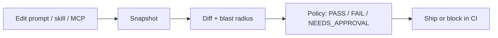
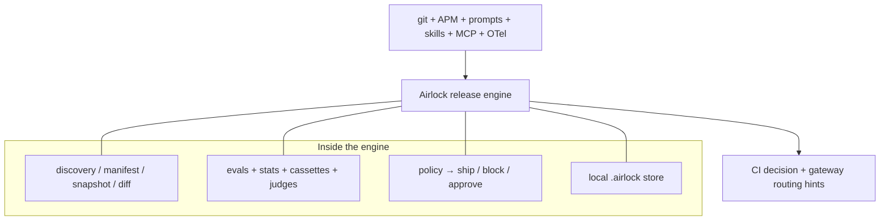

# Airlock

**AI release engineering.**

CI gate for prompts, skills, MCP, and models.

Airlock is the release-control layer for AI systems: it treats models, prompts, tools, skills, MCP servers, judges, and eval sets as a **releasable unit**, detects what changed, evaluates behavior against policy with **statistical confidence**, and **blocks or approves** the ship — including when the change came from upstream, not from your commit.

The open-source distribution is a local-first Go toolchain (binary + CI Action + `.airlock/` store). That is how you run Airlock today; it is not the ceiling of the product.

[](https://github.com/ankittk/airlock/actions/workflows/ci.yml)
[](LICENSE)
[](go.mod)
[](CHANGELOG.md)

> First public beta · no telemetry · [Apache-2.0](LICENSE) · state under `.airlock/`  
> **APM** tells you what the agent depends on · **eval platforms** tell you how it scored · **Airlock** tells you whether that change is safe to ship.  
> Not a Promptfoo/Braintrust replacement — the release gate beside them.

---

## The problem

Traditional software has a release pipeline. AI systems change behavior **without** a conventional code change: a provider updates a model behind a stable string, a prompt edits, a skill lands, a tool schema widens, an MCP server gains permissions, a retrieval index drifts, a judge shifts.

The production question is: **can we safely release this AI change?**  
And its mirror: **did a change we never made just get released to us?**

## How it works



State lives under **`.airlock/`** in your **application** repo. Nothing uploads by default.

## Who it’s for

| Good fit | Weak fit today |
|----------|----------------|
| LLM apps / agents with prompts, tools, skills, or MCP | Pure CRUD with no model/prompt/tool surface |
| Teams that change prompts or models often and want PR gates | Expecting a hosted org dashboard today (Phase 5) |
| Repos with eval cases / Promptfoo, or OTel GenAI spans | Need deep LangGraph / Vercel AI / SDK AST discovery *now* (Phase 4) |

**Not yet:** hosted control plane (Phase 5), SSO / EU / K8s (Phase 6), `airlock sentinel` (Phase 4), first-party plugins for every gateway/framework. See [roadmap](#status--roadmap).

---

## Install

**Platforms:** Linux / macOS · `amd64` / `arm64` (Windows not yet).  
Pin the tag — GitHub “latest” skips pre-releases.

```bash
AIRLOCK_VERSION=v0.1.0-beta.1 curl -sSL https://raw.githubusercontent.com/ankittk/airlock/main/install.sh | sh
# or: go install github.com/ankittk/airlock/cmd/airlock@v0.1.0-beta.1
```

## Quick start — break a prompt, watch Airlock catch it

Clone this repo. Toy agent at `testdata/toy-agent` ships prompts, a skill, MCP, and replay cassettes — **no API keys**.

```bash
cd testdata/toy-agent
airlock init && airlock snapshot
```

```console
$ airlock init && airlock snapshot
Wrote .airlock/manifest.json
  agents=1 models=1 prompts=2 tools=0 skills=1 mcp=2 evals=5
snapshot abc123…  artifacts=12  manifest=def456…
```

Nudge the system prompt (or edit a skill / widen MCP permissions):

```bash
echo "You are a DIFFERENT support agent." >> prompts/system.md
airlock snapshot && airlock diff
```

```console
$ airlock snapshot && airlock diff
snapshot ghi789…  artifacts=12  manifest=jkl012…

Changed AI artifacts:
  ~ prompt:system-prompt (a1b2c3d4 → e5f6a7b8)

Blast radius — agents: support-bot
Blast radius — evals:  default
```

Run cheap replay evals and emit the PR body:

```bash
airlock test --mode replay
airlock ci --comment
```

```console
$ airlock test --mode replay
Verdict: PASS
metric             rate             95% CI  gate
task_success      100.0%  [ 47.8%, 100.0%]  PASS
samples=9 cost=$0.0000  (cassette replay)

$ airlock ci --comment
```

```markdown
### Airlock
This PR changes AI artifacts:
- `changed` **prompt:system-prompt**

Blast radius: agents **support-bot**

### Airlock eval

**Verdict: PASS**

| metric | rate | 95% CI | gate |
|---|---:|---|---|
| `task_success` | 100.0% | [47.8%, 100.0%] | **PASS** |
```

Flip the story — expand MCP power instead of a prompt:

```bash
# e.g. add "write" under local-fs permissions in apm.lock.yaml
airlock snapshot && airlock diff
airlock ci --comment --fail-on-approval
```

```console
$ airlock diff
Changed AI artifacts:
  ~ mcp:local-fs (… → …)
NEEDS_APPROVAL: MCP new permission write on local-fs

$ airlock ci --comment --fail-on-approval
### Airlock
…
**NEEDS_APPROVAL:** MCP new permission write on local-fs
exit 1   # merge blocked until: airlock approve --base … --head …
```

That is the company wedge: **AI change control on the PR**, not “hope the prompt looks fine.”

`--mode live` hits real providers (API keys + `budgets.max_cost_per_pr`). Full walkthrough: **[docs/GUIDE.md](docs/GUIDE.md)**.

## Use it on your repo

1. In your **application** repo: `airlock init` → commit `.airlock/policy.yml` (and keep snapshots as you prefer).
2. Copy [`.github/workflows/airlock.yml`](.github/workflows/airlock.yml) into that repo (not into this one).
3. Company default: fail closed with `--fail-on-approval` / `--fail-on-eval` (sample workflow defaults `AIRLOCK_FAIL_ON_APPROVAL=true`).

### Security in CI

Airlock gates **AI release risk** on the PR — not general AppSec:

| Airlock blocks (with flags) | Still use elsewhere |
|-----------------------------|---------------------|
| MCP / write-tool / **skill** expansion (`--fail-on-approval`) | CodeQL / SAST |
| Adversarial / injection cases when MCP or skills change | Dependabot / SCA |
| Eval regressions (`--fail-on-eval`); PII in model I/O | Repo secret scanners |

Skill / MCP power expansion → `NEEDS_APPROVAL`. Approvals are advisory until CI uses `--fail-on-approval`.

---

## What ships in the stack

A full **AI release stack**, not a single command:

| Primitive | Role |
|-----------|------|
| **AI Manifest** | Normalized graph of agents, models, prompts, tools, skills, MCP, judges, evals (imports [APM](https://github.com/microsoft/apm) lockfiles) |
| **Release Snapshot** | Content-addressed record of everything needed to reproduce behavior |
| **Behavioral Diff** | What changed + blast radius; statistical candidate vs baseline (CIs, not point estimates) |
| **Policy Engine** | Gates → `PASS` / `FAIL` / `INCONCLUSIVE` / `NEEDS_APPROVAL` |
| **Cassette Store** | Deterministic replay of provider/tool HTTP for cheap CI |
| **Judge Registry** | Pinned, versioned, calibrated evaluators |
| **Production-derived evals** | OTel ingest + local redaction → baselines |
| **Drift detection** | Live vs approved baseline even with no deploy |
| **Data boundary** | Fail release when PII/secrets appear in model I/O (`data_boundary.fail_on_pii`) |
| **Rollback / routing hints** | Re-pin known-good manifest; emit decisions for gateways |
| **Model Sentinel** *(Phase 4)* | Fingerprint upstream models; catch silent provider drift |
| **Control plane** *(Phase 5)* | Shared history, approvals, audit, team policy |
| **Platform** *(Phase 6)* | K8s admission, shadow releases, SSO, EU / self-host |



## What `init` can see today

`airlock init` is **not** every industry SDK:

| Source | Today |
|--------|--------|
| APM (`apm.lock.yaml` / `apm.yml`) | Yes (skills → first-class `skill`) |
| Agent Skills (`SKILL.md` under `.claude/skills`, `.agents/skills`, `.gemini/skills`) | Yes |
| Cursor rules (`.cursor/rules/*.mdc`, `*.md`) | Yes (as `prompt`, source `cursor-rules`) |
| MCP configs / prompt files / `env.json` | Yes |
| Model strings in config / `.env.example` | Heuristic |
| Promptfoo / eval globs | Thin (Phase 4 deepen) |
| OpenAI / Anthropic / Google SDK AST | Phase 4 |
| Vercel AI SDK, LangGraph, CrewAI, … | Phase 4+ |
| Langfuse / remote prompt registries | Phase 4 |
| Live MCP schema fetch | Config hash only (Phase 4) |

Agent dependency locking is [APM](https://github.com/microsoft/apm)’s job; Airlock imports it. Details: [GUIDE — discovery](docs/GUIDE.md#discovery-coverage-honest).

## Commands

| Command | Capability |
|---------|------------|
| `init` / `snapshot` / `diff` | Manifest discovery, release snapshots, blast-radius diff |
| `test` / `ci` | Statistical evals + PR release decision |
| `ci --fail-on-eval` / `--fail-on-approval` | Fail closed (company default) |
| `import promptfoo` | Bring existing eval corpora |
| `ingest otel` / `baseline create` / `drift` | Production loop |
| `judge calibrate` / `attribution` | Judge as a versioned dependency |
| `approve` / `rollback` | Permission expansion + known-good re-pin |
| `history` | Local release history (`--serve` for read-only UI) |

Gates fire only when a confidence interval **excludes** the threshold. Cassettes replay identical provider calls by request hash (not Docker layers).

---

## Status & roadmap

| Phase | Status | Scope |
|-------|--------|--------|
| **0–3 + Now** | **`v0.1.0-beta.1`** | OSS toolchain + harness skills/rules + fail-closed CI sample |
| **4** | Next | Sentinel + one stack scanner + deeper eval/prompt sources |
| **5** | Upcoming | Org control plane: shared history, approvals, audit, team policy |
| **6** | Upcoming | Platform: K8s admission, shadow releases, SSO, EU / self-host |

```text
v0.1.0-beta.1  →  Phase 4 Sentinel/stack  →  Phase 5 control plane  →  Phase 6 platform
```

Design-partner outreach continues after the beta cut (process, not a phase). Release notes: [CHANGELOG.md](CHANGELOG.md).

## Development

```bash
go test ./... -count=1 -race
golangci-lint run ./...
```

This repository’s CI is [`.github/workflows/ci.yml`](.github/workflows/ci.yml) (Go test/lint). Releases: [docs/RELEASING.md](docs/RELEASING.md).

[Contributing](CONTRIBUTING.md) · [Security](SECURITY.md) · [Support](SUPPORT.md) · [Changelog](CHANGELOG.md) · [Guide](docs/GUIDE.md)

## License

[Apache License 2.0](LICENSE)
