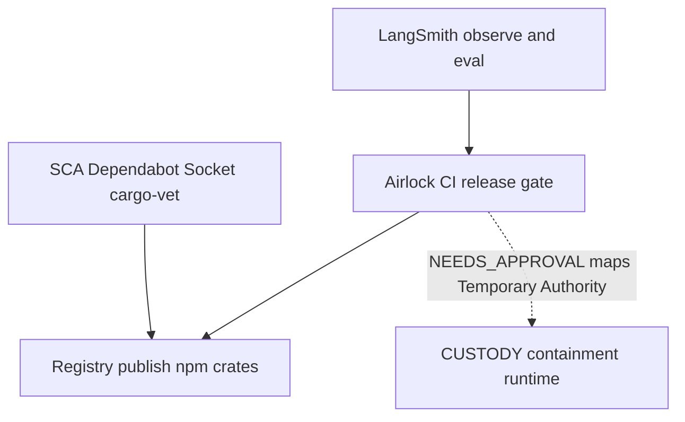

# Airlock roadmap

Plain-English plan for what ships next, what we borrow from neighboring products, and how Airlock is meant to sit **beside** them — not replace them.

Install pin and product overview live in the [README](../README.md). Release history: [CHANGELOG](../CHANGELOG.md). How to cut a release: [RELEASING](RELEASING.md).

---

## What Airlock is solving

Software has a release pipeline. Agents often do not.

Behavior can change when someone edits a prompt, adds a skill, widens an MCP tool, or a model moves behind a stable string. Traditional CI stays green. Production does not.

**Airlock** is the **CI release gate** for that surface: snapshot what the agent is, diff the blast radius, evaluate with confidence, then `PASS` / `FAIL` / `INCONCLUSIVE` / `NEEDS_APPROVAL`.

It is **not**:

- an observability or prompt playground product (LangSmith and friends)
- a runtime containment control framework (CUSTODY)
- a package-malware scanner (Dependabot, Socket, cargo-vet, Sigstore)
- a managed agent host or payment rail

Those tools answer different questions. Airlock answers: **is this AI change safe to release?**

---

## Where it sits in the stack



| Layer | Job | Airlock’s role |
|-------|-----|----------------|
| Observe / iterate | Traces, datasets, playground | Keep LangSmith (etc.); import scores later |
| **Release gate** | Ship / block / approve on the PR | **Airlock today** |
| Contain at runtime | Granted authority ≈ effective authority | CUSTODY (and PAM / network controls) |
| Package malware | Malicious npm / crates / PyPI | SCA scanners |
| Publish | Push artifacts to a registry | Phase 6: optional gate **beside** SCA |
| Spend | Caps, tokens, human approve on money | Stripe-style rails; Airlock gates the **agent surface** before that ships |

```text
edit agent artifacts
        →  observe / eval platforms (optional)
        →  Airlock snapshot / diff / policy / ci
        →  merge
        →  runtime containment (CUSTODY and friends)
        →  optional registry publish (+ SCA)
```

---

## Shipped (OSS beta / Now)

Local-first Go CLI + sample GitHub Action. State under `.airlock/`. No telemetry by default. Apache-2.0.

- **AI manifest** — agents, models, prompts, tools, skills, MCP, judges, evals (imports [APM](https://github.com/microsoft/apm) lockfiles)
- **Snapshot / diff** — content-addressed release record + blast radius
- **Policy engine** — statistical gates; `PASS` / `FAIL` / `INCONCLUSIVE` / `NEEDS_APPROVAL`
- **`airlock ci`** — PR-oriented decision; `--fail-on-eval` / `--fail-on-approval`
- **Skills & MCP** — first-class `skill`; skill/MCP power expansion → approval path; adversarial preference when those change
- **Promptfoo import**, cassette replay, judge calibrate (beta-thin where noted)
- **OTel ingest → baseline / drift** — thin production loop
- **Sample workflow** — [`.github/workflows/airlock.yml`](../.github/workflows/airlock.yml)
- **Agent-driven supply chain** — APM package dependencies tracked as `manifest.Dependency`; a new dependency landing alongside an AI-artifact change (prompt/skill/MCP/agent) raises `NEEDS_APPROVAL` in blast radius. A dependency-only PR is left to SCA (Dependabot / Socket / cargo-vet) — that stays their problem.

Discovery honesty and MCP demo: [GUIDE](GUIDE.md).

---

## Phase 4 — Shipped

Focus was deeper discovery, eval **flexibility**, and Sentinel. All Phase 4 items below are in the OSS beta toolchain.

### Model Sentinel — shipped

| | |
|--|--|
| **What** | `airlock sentinel probe\|check` fingerprints upstream models; catches silent provider drift when the string in config did not change. |
| **Why (easy)** | Git never saw a commit, but the model behind `gpt-…` moved. |
| **Integrate** | `airlock ci --fail-on-sentinel`; `airlock snapshot --sentinel` folds fingerprints into manifest `content_hash`. |

### One stack scanner — shipped

| | |
|--|--|
| **What** | OpenAI SDK + LangGraph heuristics in Python/TS/JS/Go; live MCP `tools/list` fetch for HTTP(S) servers at scan time. |
| **Why (easy)** | Today `init` was honest but thin on framework code. |
| **Integrate** | Same manifest → snapshot → diff path; stdio MCP stays config-hash until spawn support. |

### Eval flexibility — shipped

| Idea | Airlock shape | Status |
|------|---------------|--------|
| Bind tests to what changed | `.airlock/eval-bindings.yml` → suite selection in `airlock ci` | Shipped |
| Compare versions before ship | Experiment compare table in CI PR comment + `airlock test` | Shipped |
| Prod pain → better tests | `airlock eval promote --from ingest\|results` | Shipped |
| Judges as shared assets | Multi-turn judge `turns` + `{{input}}`/`{{output}}` templates | Shipped |
| Bring existing work | `import langsmith`, `import braintrust`, `import promptfoo` | Shipped |

### Lockfile supply chain — shipped

Reads `go.sum`, `package-lock.json`, and `Cargo.lock` directly into `manifest.Dependency` (alongside APM). Same agent-driven supply-chain gate: new dependency + AI-artifact change → `NEEDS_APPROVAL`.

---

## Phase 5 — Control plane

Shared product for teams, still local-first CLI underneath.

| Item | Why (easy) | Steal / integrate |
|------|------------|-------------------|
| Shared history, approvals, audit | One repo’s `.airlock/` is not enough for an org | — |
| Team policy sync | Same gates across many agent repos | — |
| **Annotation / review queues** | Humans review borderline runs and feed eval corpora | LangSmith annotation queues **idea**; Airlock stays the gate + ledger |
| Org-level evaluator library | Attach one calibrated judge to many repos | LangSmith workspace evaluators **idea** |
| Connectors to eval platforms | Pull experiments / datasets into CI gates | Import, do not host traces |

### CUSTODY-aligned vocabulary (SecOps)

[CUSTODY](https://github.com/malwarejake/CUSTODY-framework) is a **containment** framework: keep granted authority aligned with effective authority in infrastructure the agent cannot rewrite.

Airlock does **not** implement CUSTODY. We can **speak its language** so security readers map the products:

| CUSTODY pillar (idea) | Airlock mapping |
|-----------------------|-----------------|
| **Temporary Authority** | MCP / skill / write-tool expansion → `NEEDS_APPROVAL` until `approve` |
| **Conditions of Release** | `.airlock/policy.yml` gates before merge |
| **Supervision & Stop** | Fail-closed CI (`--fail-on-approval` / `--fail-on-eval`); human in the loop |
| **Observability & Escalation** | Snapshots, history, OTel ingest / drift (thin today; deepen over time) |
| **Untrusted Input** | Adversarial suites when MCP/skills change — not full prompt-injection product |
| **Yard & Egress / Disposal** | Runtime / infra — stay with CUSTODY and platform controls (Phase 6 admission is adjacent, not a replace) |

Runtime containment remains CUSTODY (and network / PAM). Airlock remains the **pre-merge** gate for the releasable agent unit.

---

## Phase 6 — Platform

Enterprise delivery and choke points after the gate exists.

| Item | Why (easy) |
|------|------------|
| K8s admission / shadow releases | Stop bad agent configs at deploy time |
| SSO, EU residency, self-host | Org requirements for a hosted control plane |
| **Registry publish gate** | Block `npm publish` / crate release / similar until Airlock **and** SCA / attestations pass |

**Explicit non-goal:** managed agent runtime, no-code Fleet-style host, or becoming the payment rail.

---

## Integration playbooks

### LangSmith / Braintrust / Langfuse / Phoenix

Keep them for traces, online evals, datasets, playground, annotation.

**Today**

1. Observe and curate in that platform.
2. In the app repo: `airlock init`, import or point at eval cases you trust (`import promptfoo` or JSONL).
3. Commit `.airlock/policy.yml`; add the [sample Action](../.github/workflows/airlock.yml); fail closed as needed.
4. Optional: `ingest otel` → baseline / drift (file/JSONL path — not a live LangSmith API sync yet).

**Later (Phase 5):** review queues that feed the gate — still no Airlock-hosted trace UI.

Also: [README — If you use LangSmith](../README.md#if-you-use-langsmith-or-braintrust--langfuse--phoenix).

### CUSTODY

| CUSTODY | Airlock |
|---------|---------|
| Contain the **running** agent | Gate **releasing** the agent unit |
| Control objectives in infra | Snapshot / diff / policy / CI |

Use both: Airlock before merge; CUSTODY (or equivalent) after deploy. Framework: [malwarejake/CUSTODY-framework](https://github.com/malwarejake/CUSTODY-framework) · [custody-framework.org](https://www.custody-framework.org/).

### Package managers / SCA

| SCA | Airlock |
|-----|---------|
| Is this package malware / known-bad? | Did this **AI change** widen what we depend on? |
| Every PR / lockfile bump | Especially when prompt/skill/MCP/agent change co-occurs with lockfile churn |
| Required for publish | Phase 6: publish gate **beside** SCA |

Do not drop Dependabot / Socket / cargo-vet because Airlock exists.

### Money / Stripe-style agent pay

Stripe’s [giving agents the ability to pay](https://stripe.com/blog/giving-agents-the-ability-to-pay) (Link wallet / Issuing / Shared Payment Tokens) puts **caps, expiry, and human approve on the credential**. The model must not hold a blank check.

Same pattern as ledger-style approval DAGs: deterministic code owns amount and audit; the LLM proposes and flags.

**Airlock’s job:** gate the agent surface (tools, MCP, prompts, skills) **before** that money-capable agent ships. Payment rails own spend; Airlock owns “was this agent change approved to release?”

---

## Non-goals

- Replace LangSmith (or similar) as trace / playground / deploy product
- Implement the CUSTODY framework as a product (vendor-neutral objectives stay theirs)
- Replace Dependabot / Socket / cargo-vet / Sigstore for classic package malware
- Re-implement [APM](https://github.com/microsoft/apm) package resolution (Airlock **imports** lockfiles)
- Host managed agents / Fleet-style no-code runtime
- Become a payment or issuing provider

---

## Design partners

Outreach and feedback are a **process**, not a numbered phase. Bugs and proposals: [GitHub Issues](https://github.com/ankittk/airlock/issues). How we take help: [SUPPORT](../SUPPORT.md), [CONTRIBUTING](../CONTRIBUTING.md).
